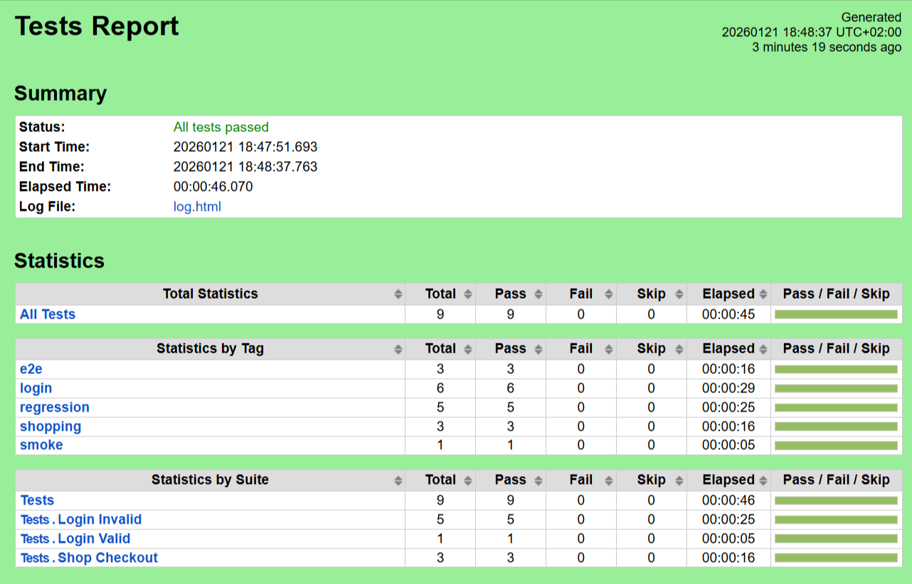
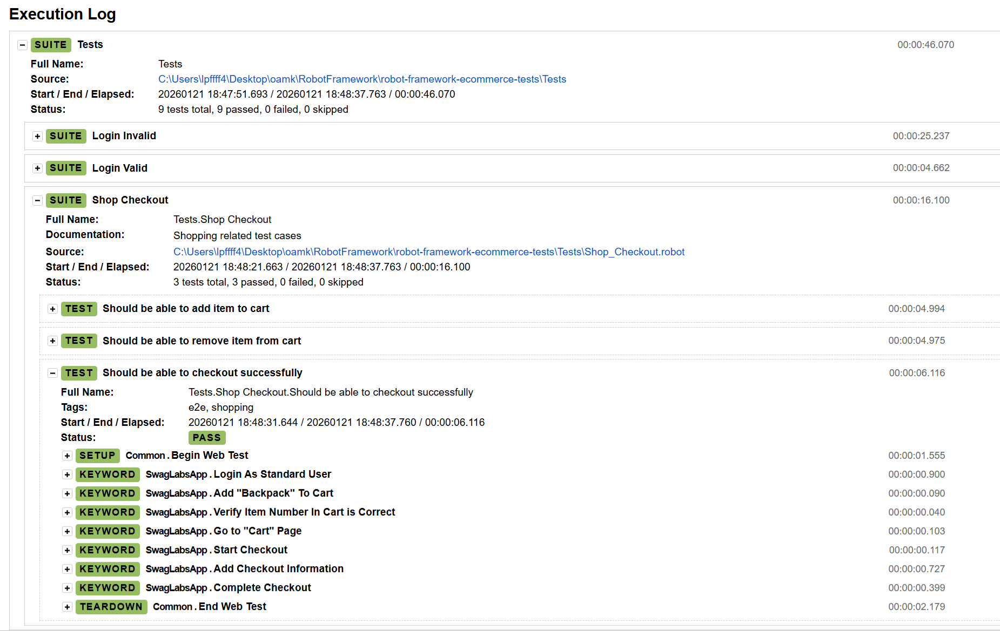
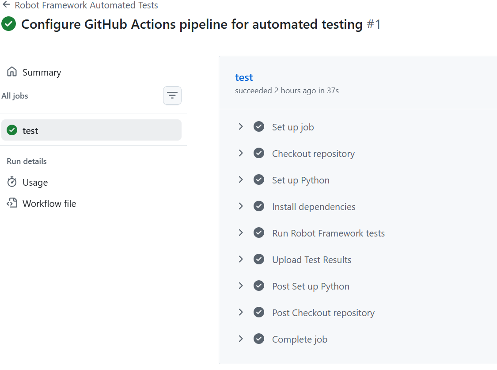

# 🤖 Robot Framework E-Commerce Automation Tests


This repository contains an End-to-End (E2E) automated testing suite for the [Swag Labs (SauceDemo)](https://www.saucedemo.com/) e-commerce website, built using **Robot Framework** and **SeleniumLibrary**.

The project implements the **Page Object Model (POM)** design pattern to ensure scalability and maintainability, and it is fully integrated with GitHub Actions for CI/CD.
## ✨ Key Features

* **Page Object Model (POM):** strict separation between test scripts (`Tests/`) and page locators/logic (`Resources/PO/`), maximizing code reusability.
* **Cross-Browser Support:** Compatible with **Chrome** and **Edge**.
* **Robust Environment Handling:** Implements `--incognito` mode by default to bypass Chrome's "Password Leak Detection" and "Save Password" native popups, ensuring stable execution.
* **Dynamic Locators:** Uses dynamic XPath strategies to handle changing element states (e.g., toggling between "Add to cart" and "Remove" buttons).
* **CI/CD Integration:** Automated workflow via GitHub Actions that runs tests in **Headless Mode** and uploads test artifacts.
* **Defensive Coding:** extensive use of `Wait Until...` keywords to handle network latency and dynamic DOM rendering.

## 📂 Project Structure

```text
robot-framework-ecommerce-tests/
├── .github/
│   └── workflows/
│       └── main.yml           # GitHub Actions CI/CD configuration
├── Resources/
│   ├── PO/                    # Page Objects (Locators & Keywords)
│   │   ├── Cart.resource
│   │   ├── CheckOut.resource
│   │   ├── Complete.resource
│   │   ├── LogIn.resource
│   │   ├── Products.resource
│   │   └── TopNav.resource
│   ├── Common.resource        # Setup & Teardown configuration
│   └── SwagLabsApp.resource   # App-specific business logic
├── Tests/                     # Test Suites
│   ├── Login_Invalid.robot    # Data-driven tests for invalid login
│   ├── Login_Valid.robot      # Happy path login tests
│   └── Shop_Checkout.robot    # Full shopping E2E flow
├── Results/                   # Output folder for Reports & Logs
├── assets/screenshots         # folder for the screenshots of Reports & Logs  
├── requirements.txt           # Python dependencies
└── README.md                  # Project documentation
```
## 🚀 Getting Started

### 1. Prerequisites
Ensure you have Python 3.10 or higher installed.

### 2.Clone the Repository
```bash
git clone  https://github.com/PengfeiLi-OAMK/robot-framework-ecommerce-tests.git
cd robot-framework-ecommerce-tests
```

### 3. Install Dependencies
```bash
pip install -r requirements.txt
```
*Note: SeleniumLibrary 4.10+ includes Selenium Manager, so you do not need to manually download ChromeDriver/EdgeDriver.*

## ✨ Running Tests
All tests are executed using the robot module.

### Run All Tests
```bash
python -m robot -d Results Tests/
```

### Run a Specific Test Suite
```bash
python -m robot -d Results Tests/Login_Invalid.robot
python -m robot -d Results Tests/Login_Valid.robot
python -m robot -d Results Tests/Shop_Checkout.robot
```

### Browser Configuration
By default, tests run in **Chrome**. You can switch browsers or modes using command-line variables.

**Run on Edge:**
```bash
python -m robot -d Results --variable BROWSER:Edge Tests/
```

**Run in Headless Mode (Recommended for CI/Servers):**
```bash
python -m robot -d Results --variable BROWSER:headlesschrome Tests/
```

## 🔄 CI/CD Workflow

This project includes a GitHub Actions workflow (.github/workflows/main.yml). The pipeline triggers automatically on:
- Push to the main branch
- Pull Requests targeting main
- Manual trigger via the "Actions" tab (workflow_dispatch)

**Workflow Steps:**

1.Sets up Python environment.
2.Installs dependencies from requirements.txt.
3.Executes tests in Headless Chrome.
4.Uploads report.html and log.html as artifacts (even if tests fail).

## 📊 Test Reporting

After execution, Robot Framework generates detailed HTML reports. Here is a preview of the results:
### 1. High-Level Summary (Report.html)

*A clear overview showing all test suites passed successfully.*

### 2. Detailed Execution Logs (Log.html)

*Step-by-step execution details, showcasing the Keyword-Driven approach.*

### 3. CI/CD Workflow Result

*Automated execution results via GitHub Actions.*

---
**Author:** Pengfei Li